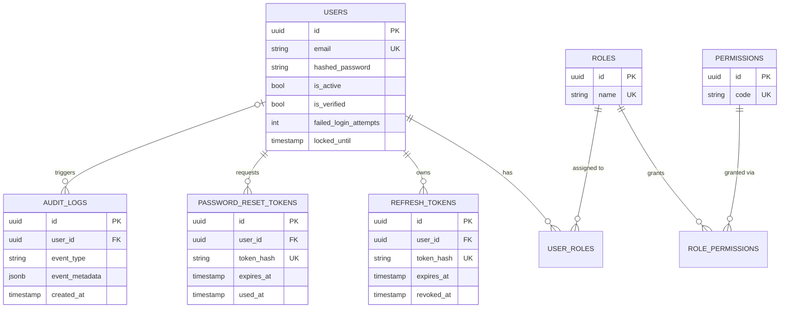

# Authentication Service

A standalone, production-grade **Authentication & Authorization microservice** built to demonstrate senior-level backend engineering practices: Clean Architecture, the Repository Pattern, SOLID principles, and a security-first approach to identity management.

Built as a portfolio project — designed to be consumed by other services, and to showcase the kind of engineering judgment (not just working code) expected at a senior level.

<!--
  Once you push this repo to GitHub, replace OWNER/REPO below with your
  actual GitHub username/repository name so the badge renders correctly.
-->


---

## Table of contents

- [Features](#features)
- [Architecture](#architecture)
- [Tech stack](#tech-stack)
- [Database schema](#database-schema)
- [Getting started](#getting-started)
- [Environment variables](#environment-variables)
- [API reference](#api-reference)
- [Security](#security)
- [Testing](#testing)
- [CI/CD](#cicd)
- [Project structure](#project-structure)
- [Known limitations & future improvements](#known-limitations--future-improvements)

---

## Features

- User registration with email verification (mock SMTP — logs the message instead of sending real email)
- Login with JWT access + refresh tokens
- **Refresh token rotation with reuse detection** — a token that's already been rotated cannot be replayed; if it is, every session for that user is revoked
- Logout (explicit refresh-token revocation)
- Password hashing with bcrypt
- Password reset via a single-use, time-limited token
- Change password (revokes all other active sessions)
- Account lockout after repeated failed login attempts, with automatic time-based unlock
- Role-Based Access Control (Admin / Manager / Employee) with a granular, database-backed permission model
- Structured (JSON) audit logging of every security-relevant event
- Per-route rate limiting (brute-force protection on login and password-reset endpoints)
- Auto-generated OpenAPI/Swagger documentation

## Architecture

This service follows **Clean Architecture**: dependencies point inward, so business rules never depend on a specific framework or database.

```
interfaces/        FastAPI routers, Pydantic schemas, DI wiring — the only layer that knows about HTTP
application/        Services (use cases) + repository interfaces (Protocols) — the business rules
domain/              Framework-free entities and exceptions
infrastructure/     SQLAlchemy models/repositories, JWT, bcrypt, email, rate limiting — swappable implementations
```

Two patterns make this work in practice:

- **Repository Pattern** — services depend on an abstract interface (e.g. `IUserRepository`), never on SQLAlchemy directly. The concrete implementation is injected at runtime.
- **Dependency Injection** — via FastAPI's `Depends()`, wired centrally in `interfaces/api/dependencies.py`.

The payoff: `AuthService` and `UserManagementService` are unit-tested with in-memory fake repositories — zero database, zero Docker, tests run in milliseconds (see [Testing](#testing)).

## Tech stack

| Concern | Choice | Why |
|---|---|---|
| Language / runtime | Python 3.12 | Latest stable, modern type-hint syntax (`X \| None`) |
| Web framework | FastAPI | Async-native, automatic OpenAPI docs |
| ORM | SQLAlchemy 2.x (async) | Async end-to-end so the event loop never blocks on DB I/O |
| Database | PostgreSQL 16 | JSONB support (audit log metadata), production-grade RDBMS |
| Migrations | Alembic | Versioned, reversible schema changes |
| Password hashing | passlib (bcrypt) | Industry-standard adaptive hashing |
| JWT | PyJWT | Smaller attack surface than `python-jose`; forces explicit algorithm allow-listing |
| Rate limiting | slowapi | ASGI-native, per-route limits |
| Logging | structlog | Structured JSON logs |
| Testing | pytest, pytest-asyncio, httpx | Async-first test stack |
| Linting / types | ruff, mypy (strict) | Fast, comprehensive static analysis |
| Containerization | Docker, Docker Compose | Multi-stage build, non-root runtime user |
| CI/CD | GitHub Actions | Lint, unit tests, integration tests, Docker build |

## Database schema



Notable design decisions:
- **UUID primary keys** (not auto-increment integers) — prevents enumeration of resources via sequential IDs.
- **Tokens are stored hashed** (`token_hash`, SHA-256), never in plaintext — identical reasoning to password storage: a leaked database shouldn't hand over usable credentials.
- **Roles ↔ Permissions is many-to-many** — an Admin can regrant permissions without a code deploy.

Seeded roles and their default permissions (`alembic/versions/..._seed_default_roles_and_permissions.py`):

| Role | Permissions |
|---|---|
| `admin` | `users:read`, `users:write`, `users:delete`, `roles:manage`, `audit:read` |
| `manager` | `users:read`, `users:write`, `audit:read` |
| `employee` | `users:read` |

## Getting started

### Prerequisites

- [Docker Desktop](https://www.docker.com/products/docker-desktop/)
- Python 3.12 (only needed for local development outside Docker)

### Quickstart with Docker Compose (recommended)

```bash
git clone <this-repo>
cd auth-service
cp .env.example .env
# Generate a real secret and paste it into .env as JWT_SECRET_KEY:
python3 -c "import secrets; print(secrets.token_hex(32))"

docker compose up --build
```

This starts three services in order: `db` (Postgres, with a persistent volume) → `migrate` (runs `alembic upgrade head` once, then exits) → `app` (the API, on `http://localhost:8000`).

- Interactive API docs: `http://localhost:8000/docs`
- Health check: `http://localhost:8000/health`

To stop: `docker compose down` (add `-v` to also delete the Postgres volume).

### Local development without Docker

```bash
python3.12 -m venv .venv
source .venv/bin/activate
pip install -e ".[dev]"

# Requires a reachable Postgres — e.g. run just the db service:
docker compose up -d db

alembic upgrade head
uvicorn auth_service.main:app --reload --app-dir src
```

> **Note:** on some systems, `pip install -e .` doesn't add `src/` to `sys.path` automatically (a known editable-install quirk, unrelated to this project). If imports fail, either use `--app-dir src` as above, or set `PYTHONPATH=src` explicitly.

### Creating the first Admin user

There is no automated bootstrap for the very first Admin account (see [Known limitations](#known-limitations--future-improvements)). After registering and verifying a user normally, promote it manually:

```sql
INSERT INTO user_roles (user_id, role_id)
SELECT u.id, r.id FROM users u, roles r
WHERE u.email = 'you@example.com' AND r.name = 'admin';
```

From there, that Admin can promote anyone else via `PATCH /api/v1/users/{id}/roles`.

## Environment variables

All variables are documented with safe defaults in `.env.example`. Never commit a real `.env` — it's already excluded via `.gitignore`.

| Variable | Purpose |
|---|---|
| `APP_NAME`, `ENVIRONMENT`, `DEBUG` | App metadata; `ENVIRONMENT=production` disables `/docs` |
| `DATABASE_URL` | Async SQLAlchemy connection string (`postgresql+asyncpg://...`) |
| `POSTGRES_USER` / `POSTGRES_PASSWORD` / `POSTGRES_DB` | Used by the `db` container and to build `DATABASE_URL` in Docker Compose |
| `JWT_SECRET_KEY` | **Must** be a random 64-hex-char secret — generate with `secrets.token_hex(32)` |
| `JWT_ALGORITHM` | Signing algorithm (default `HS256`) |
| `ACCESS_TOKEN_EXPIRE_MINUTES` | Access token lifetime (default 15) |
| `REFRESH_TOKEN_EXPIRE_DAYS` | Refresh token lifetime (default 7) |
| `MAX_FAILED_LOGIN_ATTEMPTS` | Failed logins before account lockout (default 5) |
| `ACCOUNT_LOCK_DURATION_MINUTES` | How long a locked account stays locked (default 15) |
| `RATE_LIMIT_LOGIN` | slowapi rate string, e.g. `5/minute` |
| `SMTP_HOST` / `SMTP_PORT` / `SMTP_FROM_EMAIL` | Unused by the mock email sender today; kept for a future real-SMTP swap |

## API reference

Full request/response schemas are auto-generated and always up to date at `/docs` (Swagger UI) and `/redoc`. This table is the high-level map:

| Method | Path | Auth required | Purpose |
|---|---|---|---|
| POST | `/api/v1/auth/register` | — | Create a new (unverified) account |
| POST | `/api/v1/auth/verify-email` | — | Verify an account using the emailed token |
| POST | `/api/v1/auth/login` | — | Exchange credentials for an access + refresh token pair |
| POST | `/api/v1/auth/refresh` | Refresh token | Rotate a refresh token for a new pair |
| POST | `/api/v1/auth/logout` | Refresh token | Revoke a refresh token |
| POST | `/api/v1/auth/forgot-password` | — | Request a password-reset token by email |
| POST | `/api/v1/auth/reset-password` | Reset token | Set a new password |
| POST | `/api/v1/auth/change-password` | Bearer access token | Change password while logged in |
| GET | `/api/v1/users/me` | Bearer access token | Get the current user's profile |
| GET | `/api/v1/users` | `users:read` permission | List all users |
| PATCH | `/api/v1/users/{id}/roles` | `roles:manage` permission | Replace a user's roles |
| DELETE | `/api/v1/users/{id}` | `users:delete` permission | Deactivate a user |
| GET | `/api/v1/audit-logs` | `audit:read` permission | Read recent audit events |

Example: register → verify → login → call a protected endpoint

```bash
curl -X POST localhost:8000/api/v1/auth/register \
  -H "Content-Type: application/json" \
  -d '{"email":"you@example.com","password":"a-strong-password-12+","full_name":"Your Name"}'

# The verification token is printed to the app's logs (mock SMTP):
docker compose logs app | grep mock_email_sent

curl -X POST localhost:8000/api/v1/auth/verify-email \
  -H "Content-Type: application/json" -d '{"token":"<paste-token>"}'

curl -X POST localhost:8000/api/v1/auth/login \
  -H "Content-Type: application/json" \
  -d '{"email":"you@example.com","password":"a-strong-password-12+"}'

curl localhost:8000/api/v1/users/me -H "Authorization: Bearer <access_token>"
```

## Security

- **Password hashing:** bcrypt via passlib.
- **Password policy:** minimum length (12+) over forced complexity rules, following NIST 800-63B guidance.
- **JWT:** access + refresh pair; algorithm is always explicitly allow-listed on decode (prevents "algorithm confusion" attacks).
- **Refresh token rotation + reuse detection:** a replayed, already-rotated refresh token revokes every session for that user.
- **Account lockout:** time-based (`locked_until`), self-clears — no manual unlock or background job required.
- **RBAC:** permissions are re-checked against the database on every request, not cached in the JWT — revoking a permission takes effect on the very next request, not after the token expires.
- **User enumeration resistance:** login and forgot-password return identical responses whether or not the email exists.
- **Rate limiting:** login and forgot-password are rate-limited per IP.
- **Audit trail:** every security-relevant event (login success/failure, lockout, role changes, password resets, etc.) is logged to an append-only `audit_logs` table.
- **Non-root Docker runtime user.**

## Testing

```bash
pytest tests/unit          # milliseconds, no Docker — AuthService against in-memory fakes
pytest tests/integration   # spins up a disposable Postgres container automatically
pytest                     # both suites
```

`tests/integration/conftest.py` manages the Postgres container's full lifecycle (start → migrate → tear down) via the Docker CLI — no manual setup needed, and no extra dependency like testcontainers.

## CI/CD

`.github/workflows/ci.yml` runs on every push/PR to `main`:

- `lint` — ruff + mypy (strict), in parallel with:
- `unit-tests` and `integration-tests`
- `docker-build` — builds the production image, only if everything above passed

## Project structure

```
src/auth_service/
├── domain/            # Entities & exceptions — no framework imports
├── application/        # Services (use cases) + repository interfaces
├── infrastructure/     # SQLAlchemy, JWT, bcrypt, email, rate limiting
└── interfaces/api/     # FastAPI routers, Pydantic schemas, DI wiring
alembic/                 # Database migrations
tests/
├── unit/                # Fast, no Docker
└── integration/         # Real Postgres, real HTTP layer
```

## Known limitations & future improvements

- **First Admin bootstrap is manual** (a raw SQL insert — see [above](#creating-the-first-admin-user)). A real deployment would ship a management command or seed script instead.
- **Rate limiting is in-process** (slowapi's default in-memory backend). Fine for a single instance; a multi-instance deployment needs a shared backend (e.g. Redis).
- **No scheduled cleanup job** for expired refresh/reset tokens — they're never deleted, only marked revoked/used. A periodic job would keep those tables from growing indefinitely.
- **Email is mocked** (logged, not sent). Swapping in a real provider (SES, SendGrid, Postmark) only requires a new class implementing `IEmailSender` — nothing in `AuthService` would change.
- **Audit log table has no DB-level write protection yet.** The application only ever inserts into it, but that convention isn't enforced with a `REVOKE UPDATE, DELETE` at the database-permission level.
- **No distributed tracing** (e.g. OpenTelemetry) — would help once this service is actually consumed by others, as originally planned.
